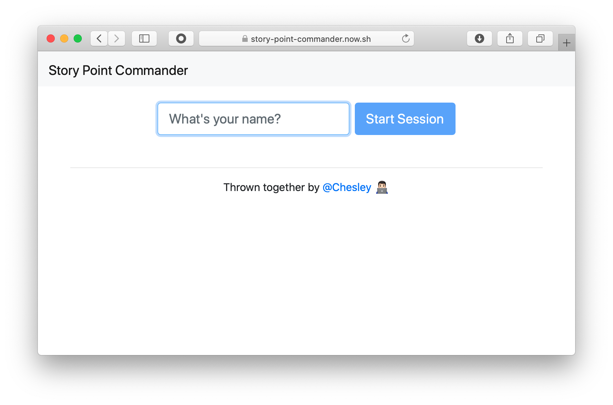

# Story Point Commander

Very opinionated story point poker. Estimate stories by thinking about the **solution effort** + **additional testing effort** + **risk level**.

Try it out for yourself!

https://story-point-commander.now.sh

  

## License

[MIT](LICENSE)
